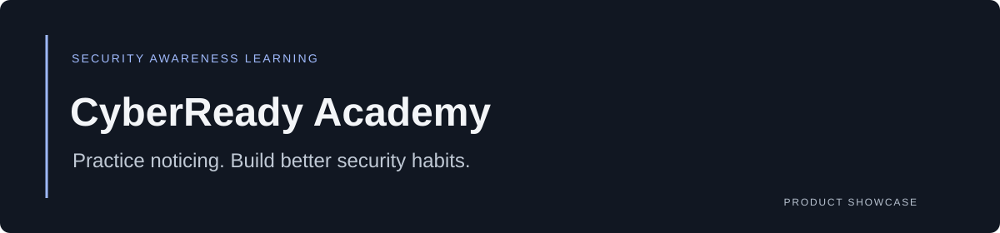

# CyberReady Academy

**Practice noticing. Build better security habits.**

CyberReady Academy is a cybersecurity awareness learning application in development. It explores how short lessons, investigation scenarios, and a visible learning journey can make employee training more approachable.

[Explore the animated learning preview](https://deadwayz.github.io/cyberready-showcase/) · [Current scope](#current-scope) · [Engineering notes](#engineering-notes)

## Why it exists

Security awareness asks people to recognize subtle risks while doing ordinary work. Passive reading alone offers little practice. CyberReady centers the experience on noticing suspicious details, choosing a response, and understanding the reason behind it.

## Preview

The [public learning preview](https://deadwayz.github.io/cyberready-showcase/) cycles through **Overview → Journey → Lesson → Investigate**. Its tabs let visitors explore the presentation directly. The screens contain illustrative learner data and are not connected to an employee training system.

The product covers five core areas:

1. Cybersecurity foundations
2. Passwords and multi-factor authentication
3. Phishing awareness
4. Social engineering
5. Incident reporting

## Current scope

| Area | Implementation state |
| --- | --- |
| Learning journey and lesson presentation | Course/module navigation, content rendering, and interactive scenario components |
| Phishing practice | Investigation and recovery scenarios |
| Account foundation | Supabase authentication and profile-role lookup |
| Learner dashboard | Interface present; displayed progress currently uses placeholder data |
| Progress, quizzes, certificates, instructor notes | Database foundation exists; several services and workflows remain unfinished |
| Administrative interface | Placeholder screen, not a complete management console |

This is a developing learning product, not a certified training platform or a completed learning-management system. The preview demonstrates product and interaction direction; it does not certify persisted completion, assessment scoring, or certificate issuance.

## Engineering notes

- **Content and presentation are separated.** Typed lesson content feeds reusable rendering components.
- **Practice is placed inside the lesson.** Phishing scenarios ask learners to investigate details rather than only read a rule.
- **A role-aware foundation.** Supabase schema and policies provide a starting point for learner/instructor workflows; completed authorization and workflow behavior still need validation.
- **Progressive product development.** Interface prototypes are labeled as prototypes rather than treated as working backend capabilities.

**Application stack:** Next.js · React · TypeScript · Tailwind CSS · Supabase · Framer Motion · Lucide

**Showcase stack:** Static HTML/CSS/JavaScript · GitHub Pages

## More projects

[Recall — reusable technical knowledge](https://github.com/deadwayz/recall-showcase) · [Duer — responsibilities and recurring work](https://github.com/deadwayz/duer-showcase) · [Creator's GitHub profile](https://github.com/deadwayz)

## Usage and permissions

See [NOTICE.md](NOTICE.md). Application source remains private; third-party assets retain their own rights and attribution requirements.
